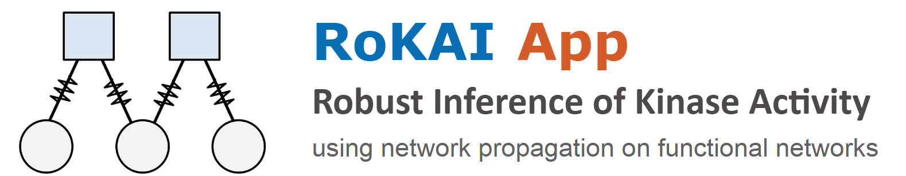

## Introduction
RoKAI is a computation tool for inferring kinase activities in a robust manner using functional networks. If you are interested in performing RoKAI through a user-friendly online interface, please visit [RoKAI Web Application](http://rokai.io) ([mirror link](https://syilmaz.shinyapps.io/rokai_app/)).

## Running Locally
To run RoKAI App locally on your R installation, simply run:
```
library(shiny)
runGitHub("rokaiapp", "serhan-yilmaz")
```
